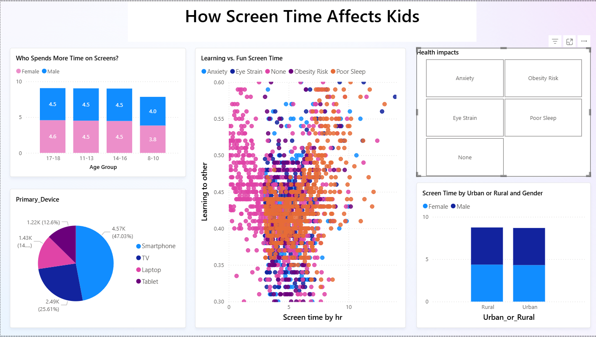

# 📊 Power BI Dashboard – Child Screen Time Analysis

This project presents an interactive Power BI dashboard that explores **screen time patterns among Indian children aged 8 to 18 years**, using simulated data modeled on real-world studies. The dashboard is designed for **parents, educators, and policymakers**, making complex data easy to understand through visuals, icons, and storytelling techniques.

---

## 🎯 Objectives

- Understand average screen time by **age group** and **gender**
- Identify the most-used **devices** (smartphones, laptops, TVs, etc.)
- Analyze the potential **health impacts** of excessive screen time:
  - 👀 Eye strain  
  - 🌙 Poor sleep  
  - ⚖️ Obesity  
  - 🧠 Cognitive fatigue
- Make the dashboard accessible and engaging for non-technical users

---

## 💡 Key Features

- 📌 **Icon-based visuals** to simplify complex topics for child-related analysis
- 🧠 **Bookmarks** to simulate storytelling and show/hide sections dynamically
- 🧪 **Filters and slicers** for gender, device type, and urban/rural population
- 📈 Visual breakdown of screen time by **age** and **gender**
- 🏥 Clear representation of health impacts tied to screen usage

---

## 🖼️ Dashboard Preview

  

---

## 📂 Project Files

| File | Description |
|------|-------------|
| `Child_ScreenTime_Analysis.pbix` | Power BI report/dashboard |
| `dataset` | Simulated input data |
| `screenshots/` | Dashboard preview images |
| `README.md` | This project overview |

---

## 🧰 Tools Used

- **Power BI Desktop**
- **DAX (Data Analysis Expressions)**
- **Power Query Editor**
- **Custom visuals and iconography**

---

## 🚀 How to Run

1. Download the `.pbix` file
2. Open in [Power BI Desktop](https://powerbi.microsoft.com/desktop/)
3. Explore filters, visuals, and bookmarks for full interactivity

---

## 📌 Insights Delivered

- Children aged **13–16** show the highest average screen time
- **Males** tend to spend more time on gaming devices; **females** prefer mobile phones
- Urban children report **higher screen usage** and more associated health risks
- Eye strain and poor sleep are **most prevalent across all age groups**

---

## 📎 About the Dataset

- The dataset simulates screen time behavior in Indian children based on trends from educational and health studies.
- **9712 entries** covering age, gender, location, screen time hours, and health impact flags.

---

---

